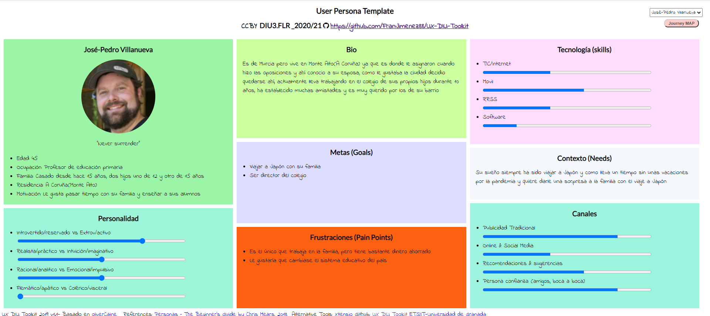
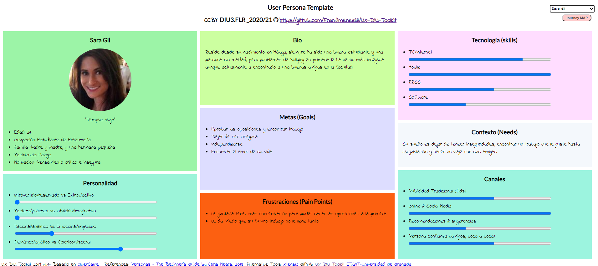
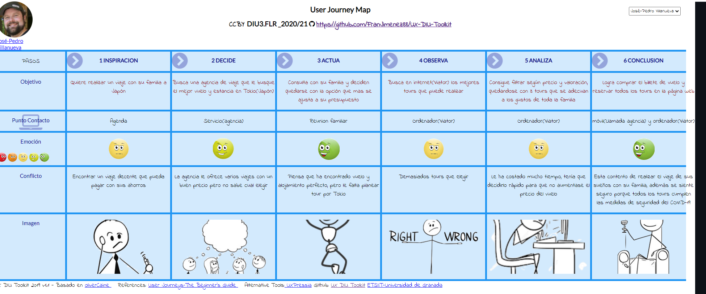

## DIU - Practica1, entregables

Alumnos: Santiago Muñoz Castro y Francisco Javier Jiménez Legaza

Grupo: DIU3_FLR

- Desk research: Análisis Competencia 
  
  Para este análisis, hemos utilizado 3 plataformas de tours, las cuales son:
  
  -[Viator](https://www.viator.com/es-ES/): es la página con la que hemos trabajado, tiene una estructura clara y sencilla, cumple con los objetivos de los usuarios y es muy    similar en nivel a la pagina civitatis. Si tuvieramos que dar una nota sería un notable alto
  
  -[Civitatis](https://www.civitatis.com/es/): esta página no tiene muchas diferencias en comparación con viator, los pequeños fallos que tenia viator son cubiertos por esta    página (como el motor de búsqueda, elementos auxiliares...). De este análisis realizado es la mejor.
  
  -[Freetour](https://www.freetour.com/es): es la página que tiene la interfaz mas rudimentaria y menos actualizada, con el peor motor de búsqueda de las tres. Aunque cumpla con su objetivo puede llegar a desesperar al usuario. Con respecto a la información aportada y elementos auxiliares cumple bastante bien.

  Tabla comparativa de las competencias: [tabla](https://github.com/FranJimenez88/DIU21/blob/master/P1/TablaComparativa.pdf)

- 2 Personas 
  
   La primera que hemos creado es José Pedro Villanueva, un hombre de 45 años, nacio en Murcia, pero reside en Monte Alto (A Coruña) donde conoció a su actual esposa, con la que tuvo dos hijos de 12 y 15 años, y realiza su profesión como profesor. Siempre ha querido viajar a Japón, por ello lleva ahorrando desde hace mucho tiempo y piensa que es el momento perfecto para realizar ese viaje.
   
   
   
   La segunda persona es una chica llamada Sara Gil de 21 años, acaba de terminar la carrera de Enfermería y se esta sacando las oposiciones, vive en Málaga con su familia y quiere realizar un viaje a la costa de Portugal con sus amigas. Es muy insegura debido a un problema de bullying en el pasado, por lo que la búsqueda del viaje sera mas difícil.
   
   
  
- 2 User Journey Map  ( 1 por persona)

  José Pedro Villanueva
  
  José decide viajar con su familia a Japón tras tantos años de ahorro, y veremos que consigue el vuelo y alojamiento, pero tiene dificultad a la hora de elegir los tours para que encajen con los gustos de toda la familia.
  
  
  
  Sara Gil
  
  Sara se encarga de realizar un viaje con sus amigas a la costa de Portugal para disfrutar de unas vacaciones juntas después de los estudios, el nivel económico (presupuesto) del grupo dificultó la búsqueda, tanto de alojamiento, transporte y tours.
  
  
 

- Revisión de Usabilidad 
  
  - Enlace del documento: [revisión](https://github.com/FranJimenez88/DIU21/blob/master/P1/Usability-review-template.pdf)
  - Valoración final: 84
  - Comentario sobre la valoración:

  La página cumple con los objetivos de los usuarios, el diseño es sencillo e intuitivo, la fluidez de la página es bastante buena aunque para ello tiene que recurrir a abrir páginas nuevas. El motor de búsqueda es bastante bueno, ya que permite también filtrar por varios tipos, aunque para que te encuentre los mejores resultados en algunos casos tienes que escribir el nombre exacto. La sección de ayuda es bastante eficaz. La información que proporciona de los tours es bastante compleja aunque faltaría la ubicación en google maps para mayor facilidad.
  En conclusión recomendamos bastante esta página, aunque consta decir que la página Civitatis cubre los fallos de esta.
  

(valoración y conclusiones de esta etapa)

  En esta etapa hemos aprendido a fijarnos en las diferencias entre las páginas, que nos ofrecen cada una de ellas y la información que nos dan. A su vez hemos adquirido los conocimientos para crear dos personas ficticias y tener imaginación para crear una historia. También nos hemos dado cuenta que hacer una interfaz perfecta para todos los usuarios es casi imposible, ya que depende de muchos factores y pensamientos de las distintas personas.

  La realización de la práctica ha sido entretenida, aunque se nos ha hecho un poco larga.

